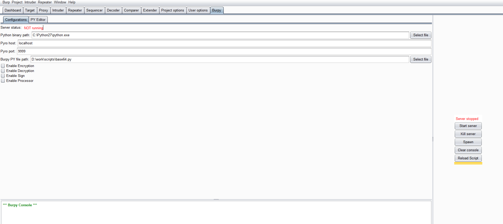
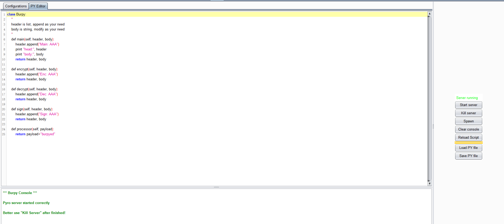
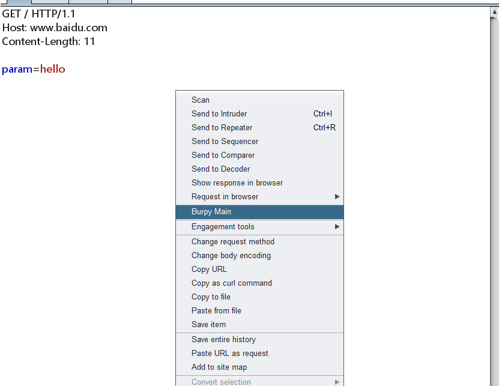
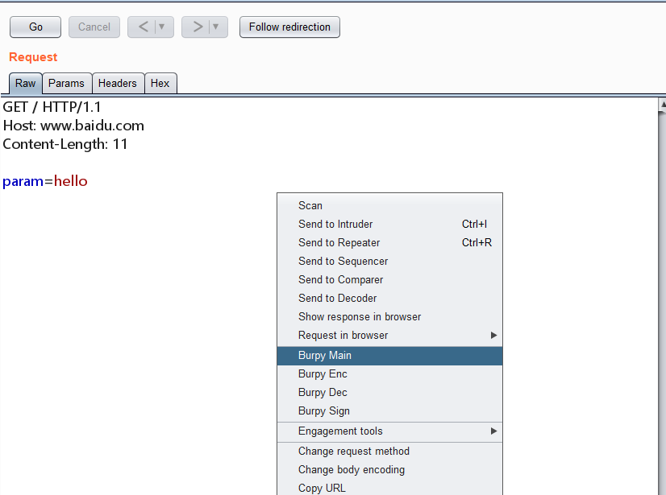
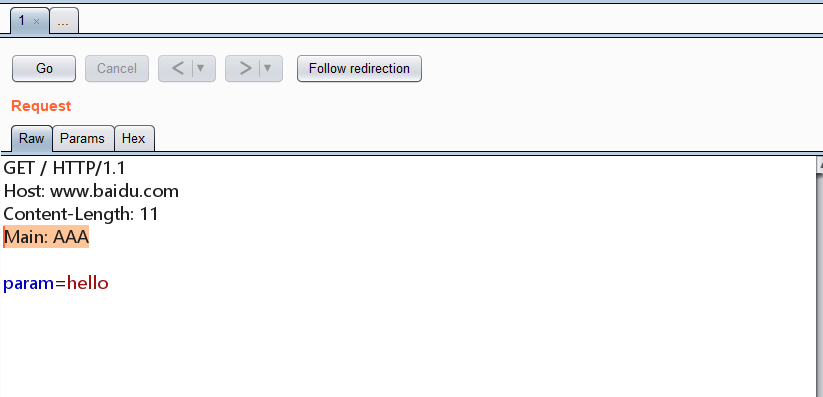
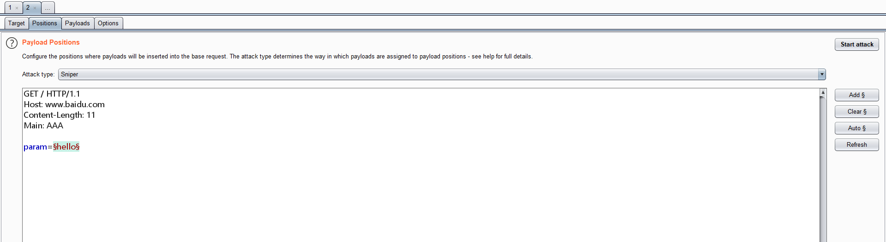
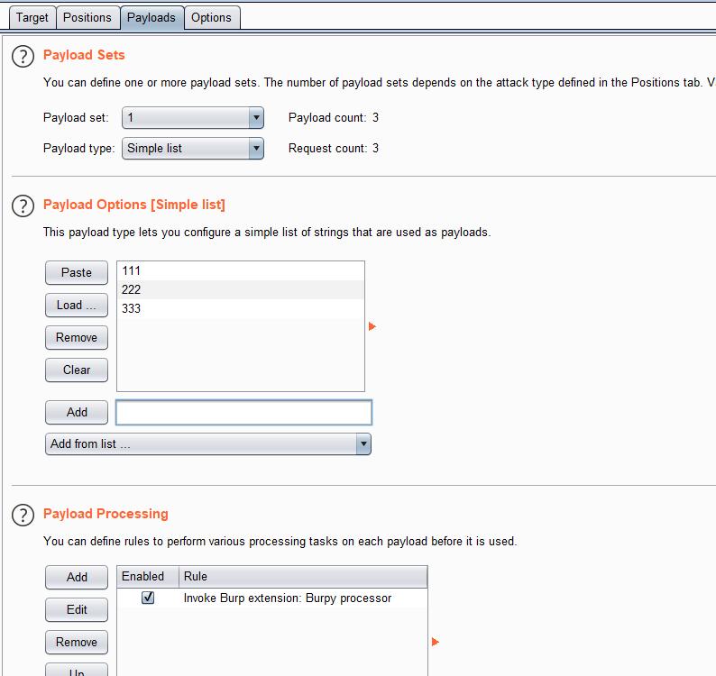
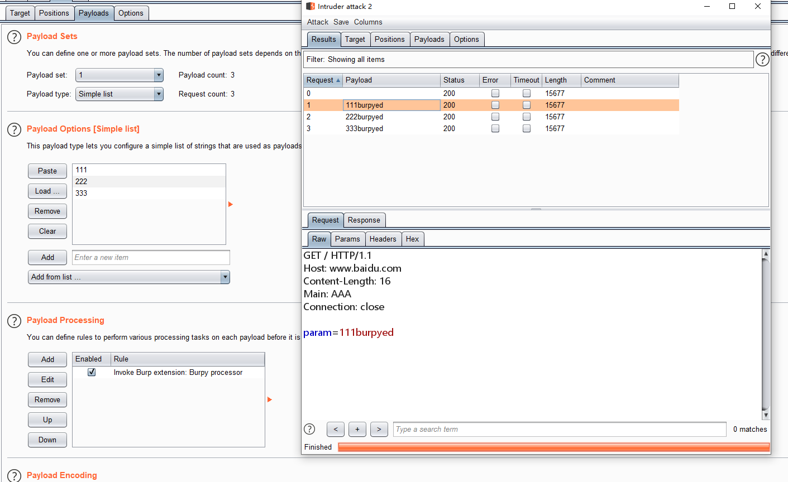
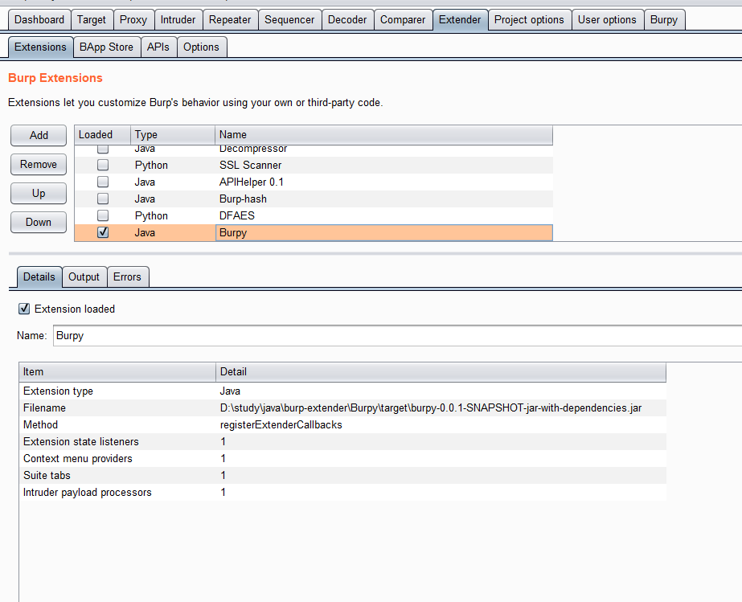

# Burpy，连接你的BurpSuite和Python

在工作中，主要任务是app安全测试。app的流量，尤其是金融类客户端的流量，基本都会涉及到加密和签名。

在App测试的时候，一般会选择Brida，它将BurpSuite和Frida结合了起来，这样BurpSuite里可以集成我们写的hook脚本，避免了在命令行和Burp之间的复制粘贴，极大了提高了渗透测试的效率。

但有些时候，你需要RSA加密或签名，密钥就在那里，通过frida再写hook有些绕了，如果因为一个项目需要就写一个插件，又比较麻烦。如果能直接运行我们的Python脚本不就完美了？

基于这个需要，我开始在Brida代码基础上实现一个其他插件，打通Burp与Python之间的路，于是就有了Burpy。

## 进化
刚开始的时候Burpy只能执行一个自己的Python函数，把在Burp中选择的内容传进去，经过函数处理之后返回给Burp。

这个是基本满足需要的，但后来发现有些测试目标，比如一些小程序，它的加解密或签名是在前端JS实现的，用Python的Selenium直接写函数的话，每次都要初始化webdriver，而这个过程是很耗时的，给人的感觉就像卡死一样，不够流畅，所以开始重新设计加载Python脚本的过程，把之前直接执行函数变成加载一个类，这样我们可以把耗时多的或需要初始化的东西放在init里面。

再到前几天，觉得用类的话，的确解决了加载的问题，但测试的时候大部分是加密、解密同时需要，偶尔还需要签名，所以之前一个类一个函数的方法导致Burpy只能执行一个功能，于是又改了一下。但加密解密签名又不是每次都需要，所以增加了`Enable Encryption` `Enable Decryption` `Enable Sign`的开关，如果没有Enable这些，直接写main函数就好，也就是Burp只完成一个功能。

后来又想到，有些测试的时候，需要进行Intruder操作，但如果payload是需要目标程序加密或签名的怎么办呢？总不能一个payload一个payload的进行加密签名地手工做吧？于是又完成了payload processor功能，如果`Enable Processor`开启，就可以在我们的脚本中实现processor函数，在Intruder的时候就可以用到这个函数。而这样一来，processor还可以方便的调用加密、解密、签名的函数。

到此，Burpy的一些功能基本上满足了我的需求，所以把它的用法简单写一下，方便大家提高干活效率。

## 使用
主界面如下，基本上与Brida一样。也是通过PyRO4进行的通信。



PY Editor里面就是我们的脚本内容，可以很方便的进行更改。


在没有Enable其他开关的时候，右键菜单里面就一个`Burpy Main`项，它调用的就是我们脚本里面的`main`函数。


我们先把这几个选项都选上


此时我们右键菜单上就增加了相应的项：


## 脚本

测试脚本如下：

```python
class Burpy:
    '''
    header is list, append as your need
    body is string, modify as your need
    '''
    def main(self, header, body):
        header.append("Main: AAA")
        print "head:", header
        print "body:", body
        return header, body
    
    def encrypt(self, header, body):
        header.append("Enc: AAA")
        return header, body

    def decrypt(self, header, body):
        header.append("Dec: AAA")
        return header, body

    def sign(self, header, body):
        header.append("Sign: AAA")
        return header, body

    def processor(self, payload):
        return payload+"burpyed"

```

很简单，不过需要注意的是，右键菜单会把整个http包给传进来，这样是为了方便进行加密、解密和签名。因为有时候会用到http header里的东西，有时候会更改header里面的东西，只传http body的话，还是不够灵活。

我们把header和body进行修改之后，再return回去，就完成了。
这个示例脚本的作用是在header里面增加一个新的header项，如`Main: AAA`，执行一个试试。



脚本里面的函数与右键菜单中的是一一对应的，所以最少需要1个main函数，当然你也可以写任意多个其他函数，只要不跟这4个函数重名就好。

## Payload Processor

脚本中的processor函数就是用做处理payload的。
我们把一个数据包发送到Intruder，然后设置一下

设置好位置：


在Payloads界面增加一个处理方式，选择`Invoke Burp extension`，然后选择我们的`Burpy processor`


在脚本中，processor函数只是在payload后面加上了`burpyed`字符

增加几个payload用来测试：


开始


实际使用的时候，只要改一下processor函数的处理方式就ok了。所以你拥有了任意处理payload的能力，而不用自己写插件啦。

## 下载与安装

```
https://github.com/mr-m0nst3r/Burpy.git
cd Burpy
mvn clean package
```

在Burp中增加：



## 其他

欢迎star，欢迎提改进意见